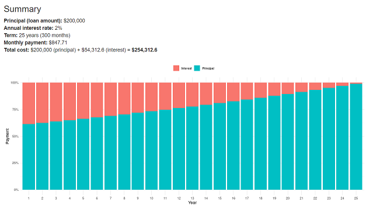

## Introduction

This presentation is part of the Developing Data Products Coursera.org course project submission.

It is an R Presentation generated with RStudio.

The Shiny application pitched by this presentation is at 
https://kaushik-sivasankaran.shinyapps.io/Course-9-Week-4-Assignment/

The Shiny app source code is available at 
https://github.com/kaushiknyn/course-9-week-4-assignment

## Overview

- The application is written in Shiny which is a web application framework for R
- The source code consists of two files: server.R and ui.R
- server.R includes the the server logic of a Shiny web application
- ui.R includes the the user-interface definition, which uses the sidebarLayout template
- The application is hosted on Rstudio's shiny server in the cloud (Shinyapps.io)

## Sidebar Panel 

- The sidebar panel provides fields for the user to input the parameters required to calculate the mortgage
- The first input field is for entering the **Principal**, which is the total loan amount the user wants to take
- The second input field is for entering the **Interst Rate**, the rate at which the bank will loan the money to the user
- The third input is a slider bar where the user can determine the best term of payment. This ranges from 1 to 30 years
- Finally there is a checkbox option for the user to visualiz the mortgage payment via an intuitive graph

## Main Panel

The main panel comprises of the summary section and the graph section

- In the summary section, the user sees the total cost of the loan he purchases given the interst rate from the bank
- In the graph, he is able to visualize how long it takes for him to pay off the interest given his input criteria

## How it Looks

This is how the interface will look:

